# Hi there, I'm Reza 👋

  <h3>📖 Full Stack Architecture & Leadership</h3>
  
<em>Document pages (click to view full size):</em>

  

    <a href="images/Full_Stack_Architecture_Leadership_pages-to-jpg-0001.jpg">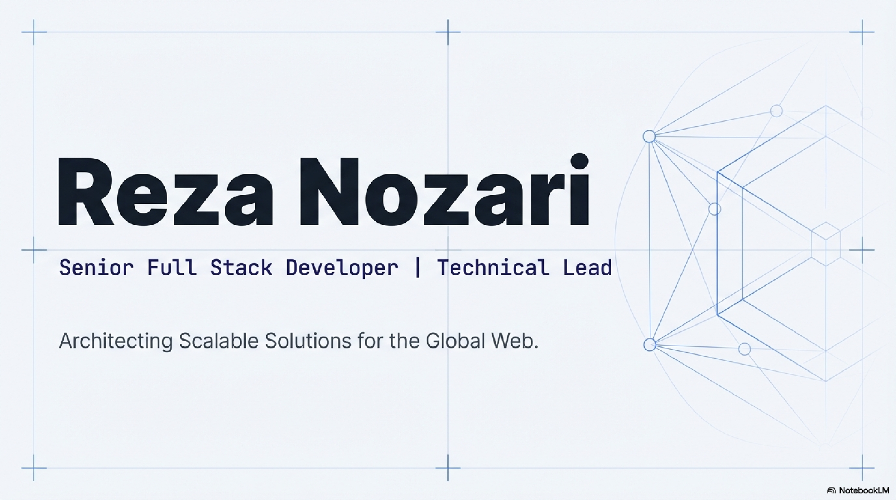</a>
    <a href="images/Full_Stack_Architecture_Leadership_pages-to-jpg-0002.jpg">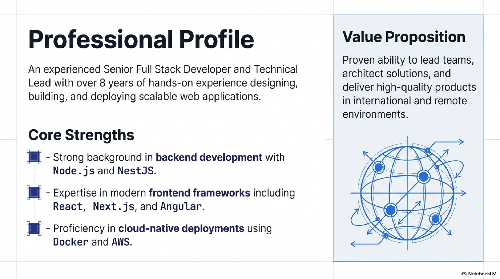</a>
    <a href="images/Full_Stack_Architecture_Leadership_pages-to-jpg-0003.jpg">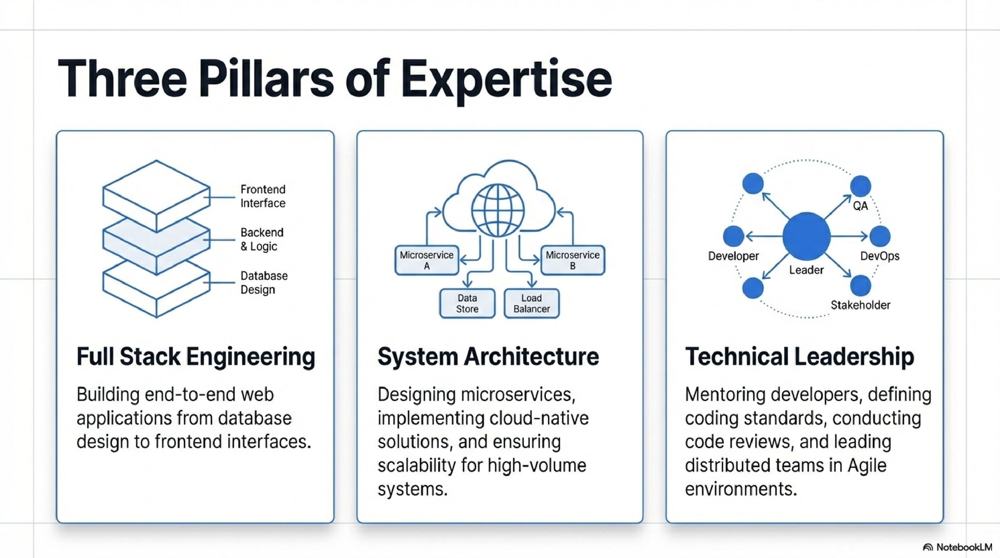</a>
    <a href="images/Full_Stack_Architecture_Leadership_pages-to-jpg-0004.jpg">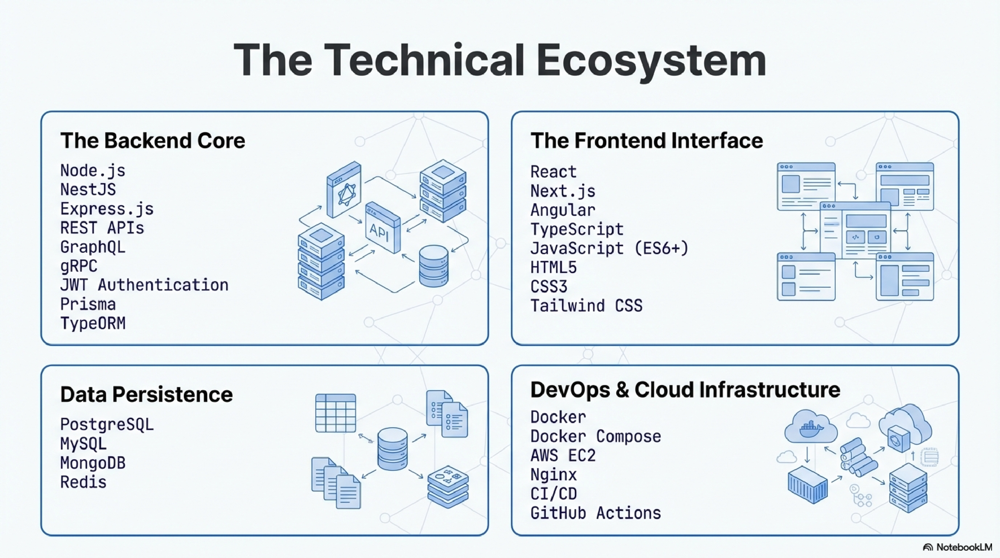</a>
  

  

    <a href="images/Full_Stack_Architecture_Leadership_pages-to-jpg-0005.jpg">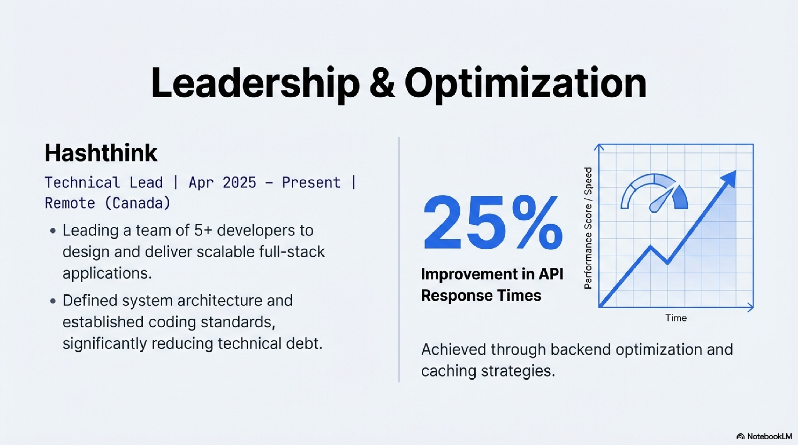</a>
    <a href="images/Full_Stack_Architecture_Leadership_pages-to-jpg-0006.jpg">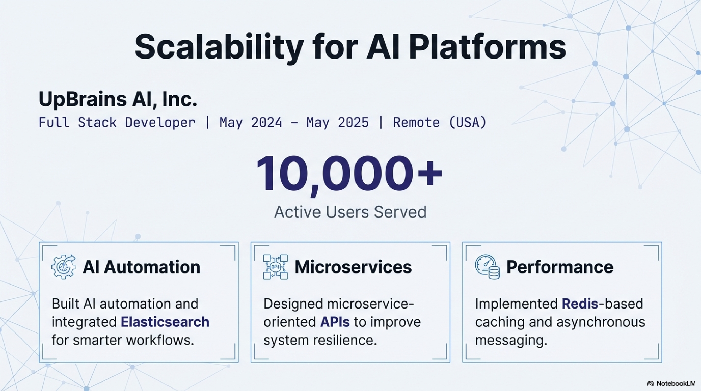</a>
    <a href="images/Full_Stack_Architecture_Leadership_pages-to-jpg-0007.jpg">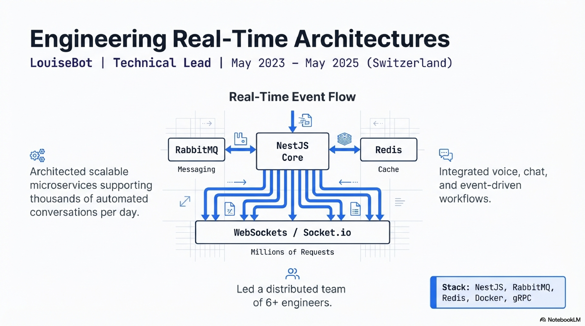</a>
    <a href="images/Full_Stack_Architecture_Leadership_pages-to-jpg-0008.jpg">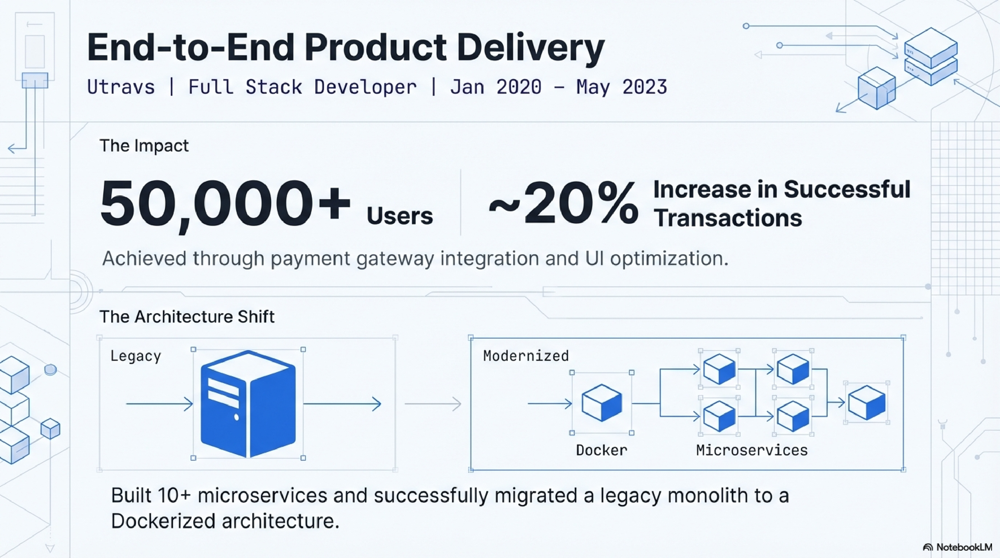</a>
  

  

    <a href="images/Full_Stack_Architecture_Leadership_pages-to-jpg-0009.jpg">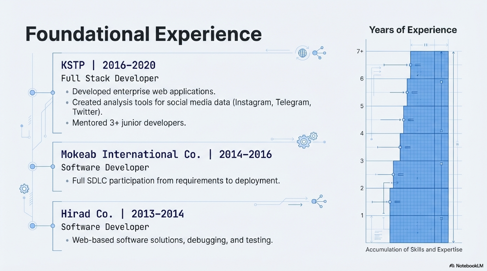</a>
    <a href="images/Full_Stack_Architecture_Leadership_pages-to-jpg-0010.jpg">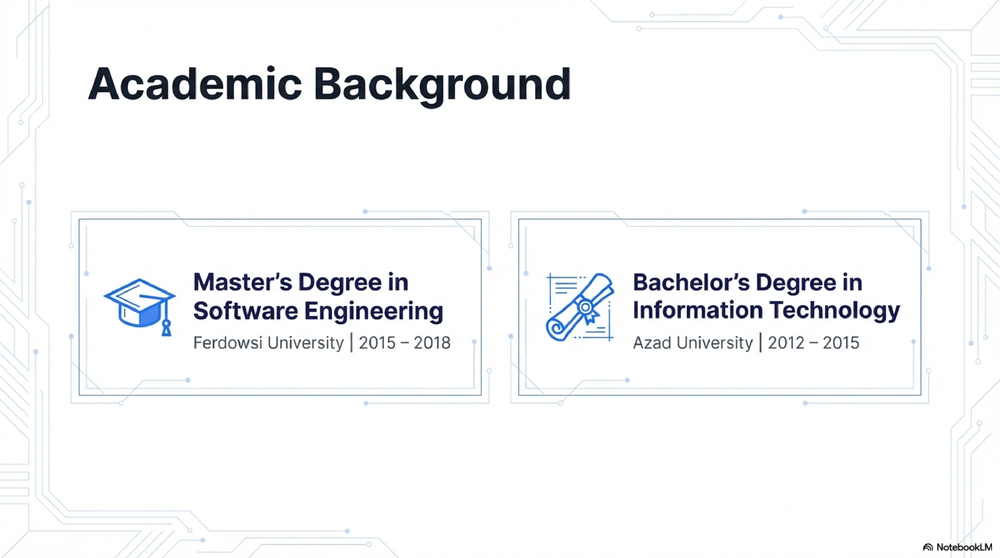</a>
    
    <a href="images/Full_Stack_Architecture_Leadership_pages-to-jpg-0012.jpg">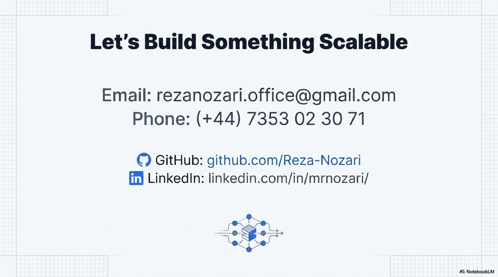</a>
  

## 🚀 What I Do  
I’m a **Technical Lead, Full Stack Developer, and Software Engineer** with professional experience in **.NET** and **JavaScript/TypeScript ecosystems**.  
I love building **scalable, maintainable software** and mentoring teams to deliver high-quality solutions.  

---

## 🛠 Tech Stack & Expertise  
- **Backend**: .NET (C#, ASP.NET Core, EF Core), Node.js, Nest.js  
- **Frontend**: React, Next.js, Angular, Vue  
- **Databases**: SQL Server, PostgreSQL, MySQL, MongoDB, Prisma, Redis  
- **Cloud & DevOps**: Docker, Kubernetes, GitHub Actions, Azure, AWS, Linux, Nginx  
- **Other Skills**: REST APIs, GraphQL, Microservices, Unit & Integration Testing, Swagger/OpenAPI, Agile practices  

---

## 📌 Featured Projects  
- 🏗️ **SaaS Platform** – Subscription management with Nest.js, Prisma, JWT, Swagger  
- ⚡ **Enterprise App** – Built with ASP.NET Core + React, using clean architecture and CI/CD pipelines  
- 🔒 **Auth & Security** – Secure authentication/authorization with .NET Identity & JWT  

---

## 👤 About Me  
I hold a degree in **Software Engineering** and have years of experience across **enterprise applications, SaaS products, and full-stack systems**.  
I thrive at the intersection of **hands-on coding, system design, and team leadership**.  

---

## 📬 Let's Connect  
- 🌐 [LinkedIn](https://www.linkedin.com/in/mrnozari/)  
- 💻 [GitHub](https://github.com/Reza-Nozari)  
- 📧 Email: dev.nozari@gmail.com  

---

## 📊 GitHub Stats    
  

